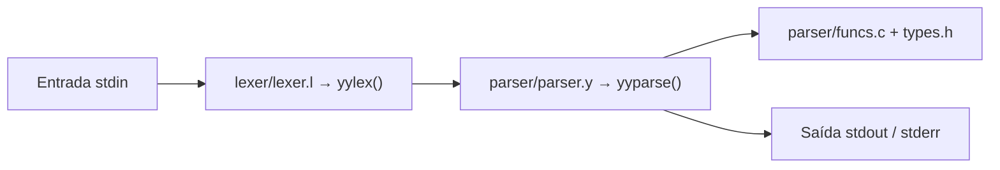

# Estrutura e arquitetura do projeto

> Este documento descreve como o repositório do interpretador de C está organizado, quais pastas e arquivos têm papéis fixos no fluxo de compilação do próprio interpretador e como encaixam a documentação e os testes. Para compilar e rodar, veja também [Como executar o interpretador](comoExecutar.md).

## Visão geral da arquitetura

O núcleo do projeto segue o modelo clássico Flex + Bison em C:

- O analisador léxico lê a entrada padrão e produz tokens;
- O analisador sintático (gramática LALR) consome esses tokens e executa ações semânticas associadas às regras (por exemplo, avaliação parcial de expressões e impressão de depuração).



- **`lexer/`** — especificação do **Flex**: padrões de texto, palavras-chave, literais e operadores mapeados para tokens compartilhados com o Bison.
- **`parser/`** — especificação do **Bison** (`parser.y`), tipos usados na união semântica (`types.h`) e funções auxiliares usadas nas ações (`funcs.c` / `funcs.h`).
- **Raiz** — `Makefile` orquestra Bison e Flex, compila os fontes gerados com o utilitário em C e gera o executável **`interpretador`**.

Arquivos gerados na pasta raiz (e removidos com `make clean`): `lex.yy.c`, `parser.tab.c`, `parser.tab.h`, além do binário `interpretador`.

---

## Organização de pastas e arquivos

Árvore simplificada do que costuma estar versionado (sem `site/`, gerado pelo MkDocs localmente):

```text
COMP-16/
├── Makefile              # build: bison → flex → gcc
├── interpretador         # executável (após make build; não versionado)
├── lex.yy.c              # gerado pelo Flex
├── parser.tab.c          # gerado pelo Bison
├── parser.tab.h          # gerado pelo Bison (tokens e YYSTYPE)
├── tests.py              # suíte: stdin → interpretador; valida stderr
├── README.md
├── lexer/
│   └── lexer.l           # regras léxicas e retorno de tokens
├── parser/
│   ├── parser.y          # gramática, união %union, main + yyerror
│   ├── types.h           # tipo Valor (valores em expressões)
│   ├── funcs.c           # operações auxiliares (ex.: fazer_operacao)
│   └── funcs.h
├── tests/
│   ├── valid/            # entradas que não devem gerar erro sintático
│   └── invalid/          # entradas que devem gerar "Erro sintático"
├── docs/                 # fonte do GitHub Pages (MkDocs)
│   ├── index.md
│   └── interpretador/
│       ├── linguagem-e-escopo.md
│       ├── linguagemInterpretada.md
│       ├── escopo.md
│       ├── estrutura.md
│       ├── comoExecutar.md
│       ├── casosTeste.md
│       ├── pontosDeControle.md
│       ├── pontosDeControlePc1.md
│       ├── pontosDeControlePc2.md
│       └── pontosDeControleEntregaFinal.md
└── mkdocs.yml            # tema, navegação e extensões do site
```

### `lexer/lexer.l`

Define o alfabeto de tokens reconhecido na entrada: tipos, identificadores, literais numéricos e de texto, operadores, delimitadores e tratamento de caracteres inválidos. Inclui cabeçalhos do analisador sintático (`parser.tab.h`) e de tipos (`parser/types.h`) para manter yylval alinhado à `%union` do Bison.

### `parser/parser.y`

Concentra a gramática (`%%` … regras), declaração de tokens e tipos (`%token`, `%type`, `%union`), precedência de operadores quando aplicável, ponto de entrada **`main`** (chamada a `yyparse()`) e `yyerror` para mensagens de erro sintático (incluindo número de linha via `yylineno` do Flex).

### `parser/types.h` e `parser/funcs.*`

- `types.h` — estruturas compartilhadas entre lexer (onde faz sentido), parser e funções auxiliares; hoje inclui o agregado `Valor` (tipo discriminado + união de `int` / `float` / `char` / string).
- `funcs.c` / `funcs.h` — lógica reutilizável nas ações da gramática (por exemplo, normalização para float e avaliação de operadores aritméticos binários).

Assim, a gramática permanece mais legível e a lógica numérica pode evoluir sem inflar cada regra no `.y`.

### `Makefile`

Encadeia `bison -d parser/parser.y` e `flex lexer/lexer.l`, depois invoca o GCC unindo `parser.tab.c`, `lex.yy.c` e `parser/funcs.c`, com `-I.` para resolver includes como `parser/types.h`. É o contrato oficial de “como o interpretador é construído” no ambiente Unix/WSL descrito no README.

### `tests/` e `tests.py`

Organização em duas classes de exemplos de programa em texto, alinhadas ao critério documentado em [Casos de teste](casosTeste.md): válidos versus inválidos no nível sintático esperado pelo projeto atual.

### `docs/` e `mkdocs.yml`

Conteúdo estático em Markdown servido pelo MkDocs (tema Material) como GitHub Pages: não entram na compilação do `interpretador`, mas descrevem linguagem, escopo, estrutura, execução e testes do mesmo repositório.

---

## Histórico de Versão

| Versão | Data | Descrição | Autor |
| :--- | :--- | :--- | :--- |
| 1.0 | 13/05/26 | Criação da página com seu respectivo conteúdo | Camila Careli |
