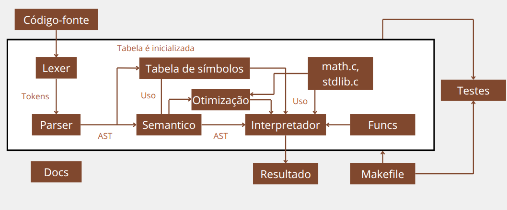

# Estrutura e arquitetura do projeto

> Este documento descreve como o repositório do interpretador de C está organizado, quais pastas e arquivos têm papéis fixos no fluxo de compilação do próprio interpretador e como encaixam a documentação e os testes. Para compilar e rodar, veja também [Como executar o interpretador](comoExecutar.md).

## Visão geral da arquitetura



O núcleo do projeto segue o modelo clássico Flex + Bison em C para formar a árvore:

- O analisador léxico lê a entrada padrão e produz tokens;
- O analisador sintático (gramática LALR) consome esses tokens e executa ações semânticas associadas às regras (por exemplo, avaliação parcial de expressões e impressão de depuração);
- O otimizador opcional percorre a árvore de sintaxe abstrata e aplica transformações para reduzir o tamanho do código intermediário;
- Por fim, o interpretador percorre a árvore de sintaxe abstrata e executa as instruções do programa;
- Estão disponíveis para uso funções auxiliares de interpretação, análise semântica, otimização, manipulação da árvore de sintaxe abstrata, tabela de símbolos e implementação de bibliotecas padrão.
- Arquivos gerados pelo interpretador (como `parser.tab.c`, `lex.yy.c` e `parser.tab.h`) são temporários e não devem ser versionados.

---

## Organização de pastas e arquivos

```text
COMP-16/
├── Makefile              # build do interpretador (Flex + Bison + GCC)
├── testes.py              # suíte de testes automatizados (Python 3)
├── README.md
├── lexer/
│   └── lexer.l           # regras léxicas e retorno de tokens
├── parser/
│   └── parser.y          # gramática, união %union, main + yyerror
|
├── lib/
|   ├── analysis
|   │   ├── otimizador.c  # funções de otimização do código intermediário
|   │   ├── otimizador.h
|   │   ├── semantico.c   # funções de análise semântica do código intermediário
|   │   └── semantico.h
|   |
|   ├── ast
|   │   ├── ast.c         # funções de manipulação e definição da árvore de sintaxe abstrata
|   │   └── ast.h
|   |
|   ├── exec
|   │   ├── funcs.c       # funções auxiliares de interpretação
|   │   ├── funcs.h
|   │   ├── interpreter.c # funções de interpretação do programa
|   │   └── interpreter.h
|   |
|   ├── interpreter
|   ├── libs              # bibliotecas padrão do interpretador (math.h, stdlib.h)
|   │   ├── comp_math.h
|   │   ├── comp_stdlib.h
|   │   ├── math.c
|   │   └── stdlib.c
|   |
|   ├── simbols           # tabela de símbolos e sua manipulação
|   │   ├── simbolos.c
|   │   └── simbolos.h
|   └── types
|       └── types.h
|
├── testes/               # Teste das estruturas implementadas no interpretador
|                         # nas etapas de execução, analise sintática e semântica, e
|                         # otimização do código, avaliando acertos e falhas
|
├── src/                  # código-fonte do interpretador (C)
|   └── main.c            # ponto de entrada do interpretador
|
└── docs/                 # documentação do interpretador (Markdown + MkDocs)
└── mkdocs.yml            # configuração do MkDocs (tema Material)
```

### `lexer/lexer.l`

Define o alfabeto de tokens reconhecido na entrada: tipos, identificadores, literais numéricos e de texto, operadores, delimitadores e tratamento de caracteres inválidos. Inclui cabeçalhos do analisador sintático (`parser.tab.h`) e de tipos (`types.h`) para manter yylval alinhado à `%union` do Bison.

### `parser/parser.y`

Concentra a gramática (`%%` … regras), declaração de tokens e tipos (`%token`, `%type`, `%union`), precedência de operadores quando aplicável, ponto de entrada **`main`** (chamada a `yyparse()`) e `yyerror` para mensagens de erro sintático (incluindo número de linha via `yylineno` do Flex).

### `lib/` e subpastas

Concentra as implementações de funções auxiliares, interpretação, análise semântica, otimização, manipulação da árvore de sintaxe abstrata, tabela de símbolos e bibliotecas. Cada subpasta tem seu próprio cabeçalho (`.h`) e implementação (`.c`).

### `lib/types.h` e `lib/funcs.*`

- `types.h` — estruturas compartilhadas entre lexer (onde faz sentido), parser e funções auxiliares; hoje inclui o agregado `Valor` (tipo discriminado + união de `int` / `float` / `char` / string).
- `funcs.c` / `funcs.h` — lógica reutilizável nas ações da gramática (por exemplo, normalização para float e avaliação de operadores aritméticos binários).

Assim, a gramática permanece mais legível e a lógica numérica pode evoluir sem inflar cada regra no `.y`.

### `Makefile`

Encadeia `bison -d parser/parser.y` e `flex lexer/lexer.l`, depois invoca o GCC unindo `parser.tab.c`, `lex.yy.c`, e as implementações em `lib/` e o fluxo de controle `main.c`, com `-I.` para resolver includes como `lib/types.h`. É o contrato oficial de “como o interpretador é construído” no ambiente Unix/WSL descrito no README.

### `testes/` e `tests.py`

Organização em duas classes de exemplos de programa em texto, alinhadas ao critério documentado em [Casos de teste](casosTeste.md): válidos versus inválidos em niveis sintático, semântico e de execução esperado pelo projeto atual.

### `docs/` e `mkdocs.yml`

Conteúdo estático em Markdown servido pelo MkDocs (tema Material) como GitHub Pages: não entram na compilação do `interpretador`, mas descrevem linguagem, escopo, estrutura, execução e testes do mesmo repositório.

---

## Histórico de Versão

| Versão | Data | Descrição | Autor |
| :--- | :--- | :--- | :--- |
| 1.0 | 13/05/26 | Criação da página com seu respectivo conteúdo | Camila Careli |
| 1.1 | 23/06/26 | Atualização de informações sobre a arquitetura do projeto e organização de pastas e arquivos | Vinícius de Jesus |
